# 第2章

# 线性表

从本章起，我们将开始对数据结构这门课程进行系统的学习。在本章中，我们将学习线性表的定义、线性表的顺序存储和线性表的链式存储，以及对线性表的基本操作，如插入、删除和查找等。

## 1. 总体要求

掌握线性表的逻辑结构及两种不同的存储结构；掌握两类存储结构(顺序和链式存储结构)的存储方法；掌握线性表在顺序存储结构及链式存储结构上实现基本操作(查找、插入、删除等)的算法。

## 2. 相关知识点

相关概念：线性表、顺序表、链表(单链表、循环链表、双向链表)、头指针、头节点。顺序表的存储及基本操作；链表的存储及基本操作。

## 3. 学习重点

线性表的逻辑结构及两种不同的存储结构；顺序表的存储和实现；链表的存储和实现。


## 线性表概述

## 1. 线性表的定义

线性表(Linear List)简称为表，是由 $n(n \geqslant 0)$ 个数据元素(也叫节点或表元素)组成的有限序列。其特点是各数据元素之间存在着线性关系，即都是一个接一个地按一定顺序排列的，并且线性表要求同一个表中的各数据元素的结构类型必须完全一致。通常将线性表记作：

$$
\left(a _ {0}, a _ {1}, a _ {2}, a _ {3}, \dots , a _ {i - 1}, a _ {i}, a _ {i + 1}, \dots , a _ {n - 1}\right)
$$

即表中 $a_{i-1}$ 领先于 $a_{i}$ ，称 $a_{i-1}$ 是 $a_{i}$ 的直接前驱元素， $a_{i+1}$ 是 $a_{i}$ 的直接后继元素。当 $0 \leqslant i \leqslant n-2$ 时， $a_{i}$ 有且仅有一个直接后继；当 $1 \leqslant i \leqslant n-1$ 时， $a_{i}$ 有且仅有一个直接前驱。

线性表中元素的个数 $n(n \geqslant 0)$ 定义为线性表的长度，特别地，当 n = 0 时称该线性表为空表。非空线性表中的每一个数据元素都有一个确定的位置，如 $a_{0}$ 是最前面一个数据元素， $a_{n-1}$ 是最后面一个数据元素， $a_{i}$ 是第 $i(0 \leqslant i \leqslant n-1)$ 个数据元素，称 i 为数据元素在线性表中的位序。


## 2. 线性表的特点

通过定义可以得到线性表有如下特点:

(1) 唯一首元素;

(2) 唯一尾元素;

(3) 除首元素外，任何元素都有一个前驱；

(4) 除尾元素外，任何元素都有一个后继；

(5) 每个元素有一个位序。

在稍复杂的线性表中，一个数据元素可以由若干数据项(Item)组成，此时这种数据元素称为记录(Record)。含有大量记录的线性表又称为文件(File)。

## 2.2 线性表的顺序存储及运算的实现

## 2.2.1 线性表的顺序存储

## 1. 线性表的顺序存储原理

线性表的顺序存储(Sequential Mapping，简称顺序表)，是指用一组地址连续的存储单元按线性表元素之间的逻辑顺序，依次存储线性表的数据元素。数据元素的逻辑顺序和物理上的存储顺序是完全一致的，物理上存放在位置 i 的元素，就是按照逻辑顺序存储时的第 i 个元素。因此在顺序存储结构下不需要另外建立空间来记录各个元素之间的关系。顺序存储的线性表是一种随机存取结构，因为只要确定了存储线性表的起始位置，就可以随机存取表中的任意一个数据元素。

## 2. 顺序存储的线性表类型定义

由于 C 语言的一维数组在内存中所占的正是一个地址连续的存储区域, 因此可以用 C 语言的一维数组来作为线性表的顺序存储结构。但是, 由于在大多数高级程序设计语言中, 数组的长度是不可变的, 因而如果用数组类型来实现顺序表, 则必须根据需要预先设置足够的长度。而在实际应用中, 数组所需长度会随问题的不同而不同, 并且在操作过程中长度也会发生变化, 因此, 在 C 语言中通常采用动态分配的一维数组来实现顺序表。顺序存储的线性表类型定义如下:

```c
#define INIT_SIZE 5    /*线性表存储空间的初始分配量*/
#define INCREMENT 2    /*线性表存储空间的分配增量*/
typedef int ElemType;    /*定义元素类型为 int*/
typedef struct {
    ElemType *elem;    /*存储空间的基地址*/
    int length;    /*当前长度*/
    int listsize;    /*当前分配的存储容量(以 sizeof(ElemType)为单位)*/
} SqList;
```

设有 SqList L，则 L 为如上定义的顺序表，表中含有 L.length 个数据元素，依次存储在 L.elem[0] 至 L.elem[L.length-1] 中，如图 2.1 所示。

<table><tr><td>元素位序</td><td>0</td><td>...</td><td>i</td><td>...</td><td>length-1</td><td>...</td><td>listsize-1</td></tr><tr><td>元素表示</td><td>L.elem[0]</td><td>...</td><td>L.elem[i]</td><td>...</td><td>L.elem[L.length-1]</td><td>...</td><td>L.elem[L.listsize-1]</td></tr><tr><td>内存状态</td><td> $a_0$ </td><td>...</td><td> $a_i$ </td><td>...</td><td> $a_{n-1}$ </td><td></td><td></td></tr></table>

图 2.1 顺序表的存储结构示意图

ElemType 为线性表中数据元素的所属类型。为处理方便，在本书中我们假定 ElemType 的类型中包含一个整型的主关键字 Key，而其余的数据项则暂时不考虑。

在上述存储结构的定义之上可实现对顺序表的各种操作，下面分别进行讨论。

## 2.2.2 顺序表的基本操作

## 1. 顺序表的初始化

顺序表的初始化，即构造一个空的表，就是为顺序表分配一个预定义大小的数组空间，这需要将 L 设为指针变量。首先动态分配顺序表的存储空间，然后将其当前长度设为 “0”，表示表中没有数据元素。

## 算法 2.1 顺序表的初始化

```c
int InitList_Sq(SqList *L)
/*初始化顺序表，成功返回1，失败返回-1*/
{
    L->elem=(ElemType *)malloc(INIT_SIZE*sizeof(ElemType)); /*分配存储空间*/
    if(!L->elem) return -1;    /*初始化失败*/
    L->length=0;
    L->listsize=INIT_SIZE;
    return 1;    /*初始化成功*/
}
```

若 L 是 SqList 类型的顺序表，则表中的第 i 个数据元素是 L.elem[i]。

## 2. 顺序表的插入

顺序表的插入操作是指在表的第 i-1 个元素和第 i 个元素之间(即在第 i 个位置)插入一个新的元素 e，插入新元素后，表长为 n 的原表 $\{a_{0}, a_{1}, a_{2}, a_{3}, \cdots, a_{i-1}, a_{i}, a_{i+1}, \cdots, a_{n-1}\}$ 变为表长为 $n+1$ 的新表 $\{a_{0}, a_{1}, a_{2}, a_{3}, \cdots, a_{i-1}, e, a_{i}, a_{i+1}, \cdots, a_{n-1}\}$ 。其中需要注意的是 i 的取值范围为 $0 \leqslant i \leqslant n$ ，当 i=n 时，表示在整个顺序表的末尾插入一个元素 e。

## 1) 插入操作需要注意的问题

(1) 顺序表中的数据区域分配有 listsize 个存储单元，在进行插入操作时需要先检查表空间是否已满，表满的情况下不能再进行插入操作，否则会产生内存溢出错误。

(2) 要检查插入位置的有效性，这里 i 的有效范围是 $0 \leqslant i \leqslant n$ ，其中 n 为原表长度。

(3) 注意数据移动的方向为向大的下标移动(从后开始向后移动)，如图 2.2 所示。

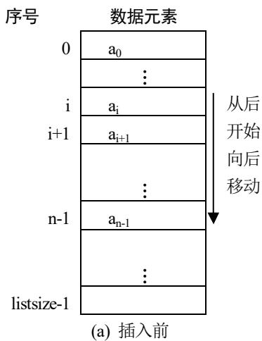

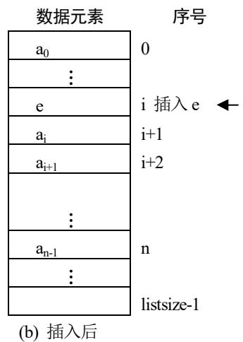  
图 2.2 在顺序表中插入一个元素

## 2) 算法思路

一般情况下，在第 $i(0 \leqslant i \leqslant n)$ 个元素之前插入一个元素时，需将第 $n - 1$ 至第 $i$ 个元素(共 $n - i$ ) 向后移动一个位置。

(1) 从后开始向后移动：将 $a_{n-1} \sim a_i$ 顺序向后移动一个位置，即 $a_{n-1}$ 移到 $a_n$ 的位置， $a_{n-2}$ 移到 $a_{n-1}$ 的位置， $\cdots\cdots$ ， $a_i$ 移到 $a_{i+1}$ 的位置，为待插入的新数据元素让出位置 $i$ 。

(2) 将 e 放到空出的第 i 个位置上。

(3) 修改线性表的当前长度 length 的值。

## 算法2.2 顺序表的插入

```c
int ListInsert_Sq(SqList *L, int i, ElemType e)
/*在顺序表 L 的第 i 个位置之前插入新的元素 e，若插入成功，则返回 1，否则返回 -1*/
{
    int j;
    ElemType *newbase;
    if (i < 0 || i > L->length) return -1;    /*插入位置不合法，插入失败*/
    if (L->length >= L->listsize)    /*当前存储空间已满，增加分配*/
    {
    newbase = (ElemType *)realloc(L->elem, (L->listsize + INCREMENT) * sizeof(ElemType));
    if (!newbase) return -1;    /*存储分配失败，插入失败*/
    L->elem = newbase;
    L->listsize += INCREMENT;
    }
    for (j = L->length - 1; j >= i; j--)
    L->elem[j + 1] = L->elem[j];    /*插入位置及之后的元素从后开始向后移动*/
    L->elem[i] = e;    /*插入 e*/
    ++L->length;    /*表长增 1*/
    return 1;    /*插入成功*/
}
```

## 3) 插入操作的时间复杂度

在顺序表上进行插入操作时，其时间主要消耗在插入位置之后的若干数据元素的移动上。

要在第 i 个位置插入元素 e，则从 $a_{i}$ 到 $a_{n-1}$ 都要向后移动一个位置，共需要移动(n-i)个元素。设在第 i 个位置上插入元素的概率为 P，则平均移动数据元素的次数为：

$$
\mathrm{E} _ {\mathrm{in}} = \sum_ {\mathrm{i} = 0} ^ {\mathrm{n}} \mathrm{P} _ {\mathrm{i}} (\mathrm{n} - \mathrm{i})\tag{2.1}
$$

其中 i 的取值范围为 $0 \leqslant i \leqslant n$ ，即有 $n+1$ 个位置可以插入。一般情况下设为等概率情况，即 $P_{i}=1/(n+1)$ ，则有：

$$
\mathrm{E} _ {\mathrm{in}} = \sum_ {\mathrm{i} = 0} ^ {\mathrm{n}} \mathrm{P} _ {\mathrm{i}} (\mathrm{n} - \mathrm{i}) = \frac {1}{\mathrm{n} + 1} \sum_ {\mathrm{i} = 0} ^ {\mathrm{n}} (\mathrm{n} - \mathrm{i}) = \frac {1}{\mathrm{n} + 1} \cdot \frac {\mathrm{n} (\mathrm{n} + 1)}{2} = \frac {\mathrm{n}}{2}\tag{2.2}
$$

可见，在顺序表中插入一个数据元素平均需要移动表中一半的数据元素，其时间复杂度为 $O(n)$ 。

## 3. 顺序表的删除

顺序表的删除操作是指将表中的第 i 个元素从线性表中删除的过程，删除第 i 个元素后原表长为 n 的线性表 $(a_{0}, a_{1}, a_{2}, a_{3}, \cdots, a_{i-1}, a_{i}, a_{i+1}, \cdots, a_{n-1})$ 变为表长为 n-1 的新表 $(a_{0}, a_{1}, a_{2}, a_{3}, \cdots, a_{i-1}, a_{i+1}, \cdots, a_{n-1})$ 。其中需要注意的是，i 的有效范围为 $0 \leqslant i \leqslant n-1$ 。

## 1）删除操作需要注意的问题

(1) 删除第 i 个元素时，要删除的元素必须真实存在，所以需要检查 i 的取值是否有效，i 的有效取值范围为 $0 \leqslant i \leqslant n - 1$ ，否则操作失败。

(2) 表为空表时不能执行删除操作。

(3) 注意数据移动的方向为向小的下标移动(从前开始向前移动)，如图 2.3 所示。

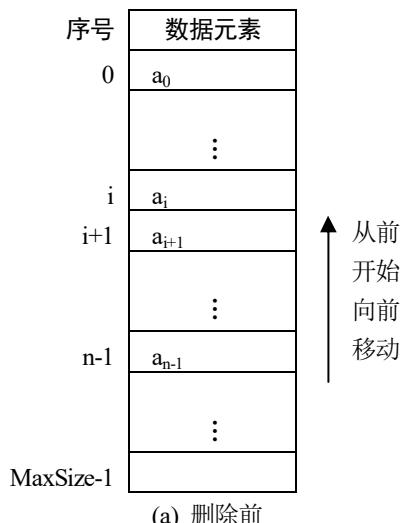  
(a) 删除前

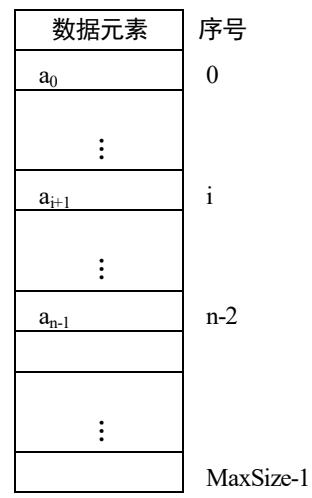  
(b) 删除后  
图 2.3 从顺序表中删除一个元素

## 2) 算法思路

(1) 从前开始向前移动：将 $a_{i+1} \sim a_{n-1}$ 顺序向前移动一个位置。

(2) 修改线性表当前长度 length 的值。

## 算法 2.3 顺序表的删除

```c
int ListDelete_Sq(SqList *L, int i, ElemType *e)
/*在顺序表 L 中删除第 i 个元素，并用 e 返回其值，成功返回 1，失败返回 -1*/
{
    int j;
    if (i < 0 || i > L->length - 1) return -1;    /*i 值不合法，删除失败*/
    *e = L->elem[i];    /*将被删除元素的值赋给 e*/
    for (j = i + 1; j <= L->length - 1; j++)
    L->elem[j - 1] = L->elem[j];    /*被删元素之后的元素从前开始向前移动*/
    --L->length;
    return 1;    /*删除成功*/
}
```

## 3) 删除操作的时间复杂度

在顺序表上进行删除操作时，其时间也同样主要消耗在删除元素之后的其他数据元素的移动上。要删除第 i 个元素，其后面的元素 $a_{i+1} \sim a_{n-1}$ 都要向前移动一个位置，共移动了 $(n-i-1)$ 个元素，平均移动数据元素的次数为：

$$
\mathrm{E} _ {\mathrm{de}} = \sum_ {\mathrm{i} = 0} ^ {\mathrm{n} - 1} \mathrm{P} _ {\mathrm{i}} (\mathrm{n} - \mathrm{i} - 1)\tag{2.3}
$$

其中 i 的取值范围为 $0 \leqslant i \leqslant n-1$ ，即有 n 个元素可以删除。在等概率情况下， $P_{i}=1/n$ ，则有如下公式：

$$
\mathrm{E} _ {\mathrm{de}} = \sum_ {\mathrm{i} = 0} ^ {\mathrm{n} - 1} \mathrm{P} _ {\mathrm{i}} (\mathrm{n} - \mathrm{i} - 1) = \frac {1}{\mathrm{n}} \sum_ {\mathrm{i} = 0} ^ {\mathrm{n} - 1} (\mathrm{n} - \mathrm{i} - 1) = \frac {1}{\mathrm{n}} \cdot \frac {\mathrm{n} (\mathrm{n} - 1)}{2} = \frac {\mathrm{n} - 1}{2}\tag{2.4}
$$

由此可见，在顺序表上删除一个数据元素平均需要移动约表中一半的数据元素，故该算法的时间复杂度为 $O(n)$ 。

## 4. 顺序表的按值查找

顺序表的按值查找是指在顺序表 L 中查找是否存在与给定值 e 相等的数据元素。最简便的方法是，将 e 和 L 中的数据元素逐个进行比较。

## 1) 算法思路

从最前面一个元素 $a_{0}$ 开始向后依次将顺序表中的元素 $a_{i}$ 与 e 相比较，直到找到一个与 e 相等的数据元素，返回这个数据元素在表中的位置；若顺序表中的所有元素都与 e 不相等，即查找不到与 e 相等的数据元素，则返回 -1，表示查找失败，如算法 2.4 所示。也可以从最后一个元素 $a_{n-1}$ 开始向前依次将顺序表中的元素 $a_{i}$ 与 e 相比较，直到找到一个与 e 相等的数据元素，返回这个数据元素在表中的位置；若顺序表中的所有元素都与 e 不相等，即查找不到与 e 相等的数据元素，则返回 -1，表示查找失败。

算法 2.4 顺序表的按值查找  
```c
int LocateElem_Sq(SqList L, ElemType e)
/*在顺序线性表 L 中查找第 1 个值与 e 相等的元素的位序，若找到，则返回其在 L 中的位序，否则返回 -1*/
{ int i=0;    /*i 的初值为最前面一个元素的位序*/
    while(i<L.length&&L.elem[i]!=e) i++;    /*从前向后逐一比较*/
    if(L.elem[i]==e) return i;    /*查找成功，i 为与 e 相等的第一个元素的位序*/
    else return -1;    /*查找失败*/
}
```

## 2) 顺序表按值查找的时间复杂度

算法 2.4 的时间主要耗费在 e 与 $a_{i}$ 的比较上，而比较的次数既与 e 在表中的位置有关，也与表长有关。查找成功的最好情况是 $a_{0}=e$ ，比较一次就成功；最坏的情况是 $a_{n-1}=e$ ，需要比较 n 次才成功。平均比较次数为 $(n+1)/2$ ，故该算法的时间复杂度为 $O(n)$ 。

## 5. 取顺序表中的元素

取顺序表中的元素是指根据所给的序号 i 在顺序表中查找相应数据元素的过程。

## 1) 算法思路

首先确认所查找的数据元素序号是否合法，若合法，则直接返回对应的元素值，否则操作失败。

## 算法2.5 取顺序表中的元素

```c
int Get_SqList(SqList L, int i, ElemType *e)
/*在顺序线性表 L 中取第 i 个元素存入 e 中，若成功，则返回 1，否则返回 -1*/
{
    if (i < 0 || i > L.length - 1) return -1;    /*没有第 i 个元素，读取失败*/
    *e = L.elem[i];
    return 1;    /*读取成功*/
}
```

## 2) 取顺序表中元素的时间复杂度

顺序表是随机存储结构，具有按数据元素的序号随机存取的特点，则计算任意元素的存储地址的时间是相等的，与数据元素所在位置无关，因此算法2.5的时间复杂度为O(1)。

## 6. 顺序表的应用

【例 2.1】有顺序表 LA 和 LB，其元素均按从小到大的升序排列，编写一个算法，将它们合并成一个顺序表 LC，要求 LC 的元素也按从小到大的升序排列。

## 1) 算法思路

依次扫描 LA 和 LB 的元素，比较线性表 LA 和 LB 当前元素的值，将较小值的元素赋给 LC，如此直到一个线性表扫描完毕，然后将未扫描完的那个顺序表中余下的元素赋给 LC 即可。因此线性表 LC 的容量应不小于线性表 LA 和 LB 的长度之和。

## 2) 算法描述

```c
int MergeList_Sq(SqList LA,SqList LB,SqList *LC)
/*已知顺序线性表 LA 和 LB 的元素按值非递减排列，合并 LA 和 LB 得到新的顺序线性表 LC，LC 的元素也按值非递减排列，若成功，则返回 1，否则返回 -1*/
{
    int i=0,j=0,k=0;
    LC->listsize = LA.length + LB.length;
    LC->elem=(ElemType *)malloc(LC->listsize* sizeof(ElemType));
    if(!LC->elem) return -1;
    while(i<LA.length&&j<LB.length)
    {
    if(LA.elem[i]<=LB.elem[j]) LC->elem[k++] =LA.elem[i++];
    else LC->elem[k++] =LB.elem[j++];
    }
    while(i<LA.length) LC->elem[k++] =LA.elem[i++];
    while(j<LB.length) LC->elem[k++] =LB.elem[j++];
    LC->length=k;
    return 1;
}
```

## 3) 算法的时间复杂度

本算法的基本操作为 “元素赋值”，算法的时间复杂度为 O(LA.length+LB.length)。

## 2.3 线性表的链式存储及运算的实现

顺序表的存储特点是逻辑上相邻的元素在物理存储上也相邻，因此必须用连续的存储单元来顺序存储线性表中的各个数据元素。正因为顺序表的这个特性，所以在对顺序表进行插入、删除等操作时需要通过移动相应的数据元素来实现，平均要移动半个表长的元素节点，因而当线性表中数据元素较多时就会严重影响运行效率。因此本节我们将介绍线性表的另外一种存储结构——链式存储结构(简称链表)。线性表的链式存储结构是用一组任意的存储单元来存放线性表的数据元素，这组存储单元可以是连续的，也可以是不连续的。在链表中数据元素之间的逻辑关系通过指针来指示，因此对链表进行插入、删除等操作时不需要移动数据元素，只需要修改链表指针即可。不过链式存储也有其自身的缺点，即失去了顺序表可随机存取元素的优势。

## 2.3.1 单链表

链表通过一组任意的存储单元来存储线性表中的各个数据元素，数据元素之间逻辑上的线性关系通过在节点中专用的一个指针来体现。对于每一个数据元素 $a_{i}$ 来说，链表除了存储数据元素自身的值 $a_{i}$ 之外，还需要和 $a_{i}$ 一起存放其直接后继节点 $a_{i+1}$ 所在存储单元的内存起始地址，这样才能把数据元素之间的逻辑关系完全体现出来，从宏观上来看好像是穿起一串珠子的手链。每一颗珠子都包含两部分，一部分是数据元素的内容，一部分是下一个节点的地址指针，这两部分组成手链上一个完整的“结”，其结构如图2.4所示。

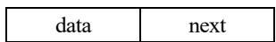  
图 2.4 单链表节点结构

## 1. 单链表存储原理

存储数据元素信息值的域称为数据域(data)，存放其后继节点地址指针的域称为指针域(next)。因此含有 n 个元素的线性表可以通过每个节点的指针域的联系形成一个链表。每个节点中只有一个指向后继节点的指针，因此又将这种链表称为单链表或线性链表。

作为线性表的一种存储结构，节点之间的逻辑结构比每一个节点的实际内存地址显得更重要，因此通常的单链表习惯用图 2.5 的形式来表示。

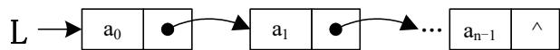  
图 2.5 单链表示意图

## 2. 单链表数据类型定义

链表是由若干节点构成的，线性表的单链表存储结构描述如下：

```c
typedef struct LNode {
    ElemType data;
    struct LNode *next;
} LNode, *LinkList;
```

上面定义的 LNode 是节点的类型，LinkedList 是指向 LNode 节点类型的指针类型。通常将标识一个链表的头指针声明为 LinkedList 类型的变量，如 “LinkedList L;”，即定义一个 LinkedList 类型的变量 L，作为单链表的头指针来表示一个单链表。通常用 “头指针” 来标识一个单链表，如单链表 L、单链表 H 等，如果头指针为 NULL，则表示此单链表是一个空表，其长度 n 为“零”。当 L 有定义时，若值为 NULL，则表示其为一个空单链表；否则最前面的节点的内存地址，即为链表的头指针。

若将指向某节点的指针变量 q 设定为 LNode 类型，如 “LNode \*q;” 或 “LinkedList q;”，而语句 “q=(LNode \*)malloc(sizeof(LNode));” 则表示分配一个 LNode 类型节点的存储空间，并将其地址赋给指针变量 q，如图 2.6 所示。q 所指节点为 \*q，\*q 的类型即为 LNode 类型，该节点的数据域为 (\*q).data 或 q->data，指针域为 (\*q).next 或 q->next。free(q) 则表示释放 q 所指向节点的存储空间。

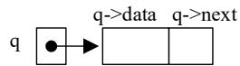  
图 2.6 申请一个节点

## 3. 建立单链表

由于单链表是一种动态结构，每个链表占用的空间不需要预先分配，而是由系统根据需要动态生成，因此，建立单链表的过程就是一个动态生成链表的过程。即从“空表”的初始状态起，依次建立各元素节点，并逐个插入链表。单链表的建立可以根据线性表元素的输入顺序与单链表中节点的顺序是否相同分为以下两种方法。

## 1) 头插入法建立单链表

链表是一种动态管理的存储结构，链表中的每个节点占用的存储空间都不需要预先分配，一般是在运行时系统根据需求而实时生成的，因此建立单链表都是从空表开始的。头插入法建立单链表也称为逆序建表，其算法思想是建立单链表时每读入一个数据元素则向系统申请一个节点空间，然后插在链表的头部。图 2.7 所示为线性表(35, 48, 28, 67, 59)对应的单链表建立过程，因为是在链表的头部插入，所以读入数据的顺序和线性表中各数据元素的逻辑顺序是相反的。

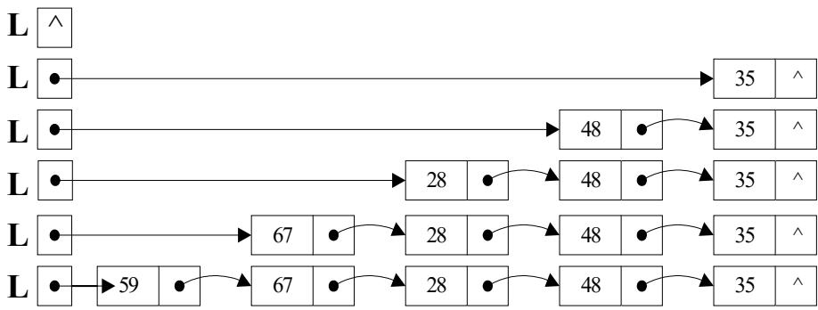  
图 2.7 头插入法建立单链表示意图

## 算法 2.6 头插入法建立单链表

```c
LinkList CreatHead_LinkList(int n)
/*建立一个单链表 L，输入 n 个元素的值*/
{
    LinkList L=NULL;    /*建立空链表 L*/
    LNode *s;
    int i;
    for(i=0; i<=n-1; i++)
    {
    s=(LNode *)malloc(sizeof(LNode));    /*生成新节点*/
    printf("请输入第%d 个元素的值:",i);
    scanf("%d",&s->data);    /*输入元素值*/
    s->next=L;
    L=s;
    }
    return L;
}
```

## 2) 尾插入法建立单链表

头插法建立单链表虽然简单，但读入数据的顺序与链表中元素的顺序是完全相反的，这会让人感觉到十分别扭和不方便。如果希望两者的顺序一致，则可以用到我们接下来要介绍的尾插入法建立单链表算法。在尾插入法建表过程中，每次都要将新节点插入链表的尾部，而单链表一般都是用头指针来指示的，所以如果要找到单链表的尾部，则每插入一次都要将插入点指针从头到尾扫描一遍。很明显，这样会耗费很多时间在重复的扫描工作上。为了精简算法节约运行时间，我们这里又专门设立了一个尾指针 p 始终指向单链表中当前的尾部节点，这样便能够将新节点直接插入链表尾部，使耗费时间为一个常量。图 2.8 显示了在单链表尾部插入节点建立链表的过程。

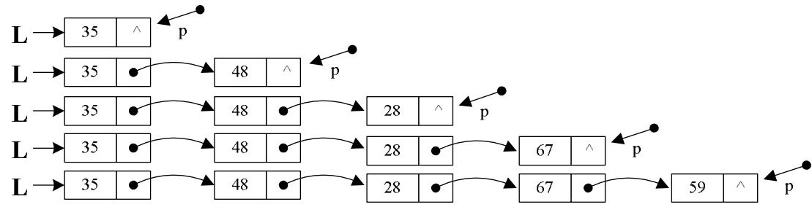  
图 2.8 尾插入法建立单链表示意图

算法 2.7 尾插入法建立单链表  
```c
LinkList CreatRear_LinkList(int n)
/*建立一个单链表 L，输入 n 个元素的值*/
{
    LinkList L=NULL;    /*定义一个空表*/
    LNode *s,*p=NULL;    /*定义新节点指针和尾指针*/
    int i;
    for(i=0; i<=n-1; i++)
    {
    s=(LNode *)malloc(sizeof(LNode));    /*生成新节点*/
    printf("请输入第%d 个元素的值:",i);
    scanf("%d",&s->data);    /*输入元素值*/
    if(L==NULL) L=s;    /*插入的节点是最前面的节点*/
    else p->next=s;    /*插入的节点是第一个以外的节点*/
    p=s;    /*p 恒指向插入后的链表尾节点*/
    }
    if(p!=NULL)p->next=NULL;    /*如果链表非空，则尾节点的指针域置为空*/
    return L;
}
```

## 3) 建立单链表的算法时间复杂度

算法 2.6 和算法 2.7 耗费的时间与所建立的线性表中数据元素的数量有关，其时间复杂度为 O(n)。

## 4）建立单链表时特殊节点的特殊处理

在算法 2.7 中可以看到，插入链表的最前面的节点是做了额外处理的，其处理方法与其他节点不同，因为最前面的节点插入时原链表为空表，它作为链表的最前面的节点是没有直接前驱节点的，所以它的地址就是整个链表的起始地址，该值需要放在链表的头指针变量中，而后面再插入的其他节点都有直接前驱，所以只需要将新建节点的地址放入直接前驱节点的指针域即可。所以在实现算法时，一定不要忘记对特殊节点进行特殊处理。

有什么办法能够将所有节点的操作都统一起来从而达到优化算法的目的？在这里，我们引入了头节点的概念。

## 4. 带头节点的单链表

在链表的头部加入一个特殊的节点 H，这个节点的类型与数据节点一致，但是其数据域不存放有效值，标识链表的头指针变量 L 指向该节点 H，这个节点即为头节点。有了头节点 H 之后，即便链表为空表，头指针 L 也不为空，其始终指向头节点的内存地址。可以将头节点看成链表最前面的节点的直接前驱，这样，链表的最前面的节点也有直接前驱了，因而在插入和删除操作中就无须再对其进行特殊处理了。头节点的加入使得空表和非空表的处理达成一致，操作起来简洁易懂，更为方便。

头节点的特征就是其数据域无定义，指针域存放链表中第一个数据节点的物理地址。图 2.9 分别是带头节点的单链表空表和非空表的逻辑图。

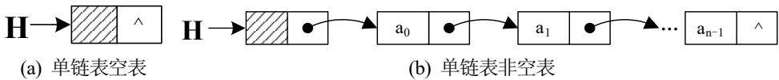  
图 2.9 带头节点的单链表

下面通过算法 2.8 和算法 2.9，介绍建立带头节点的空单链表及从尾部插入建立非空单链表的方法。

## 算法 2.8 带头节点的单链表初始化

单链表的初始化就是构建一个空的单链表，若成功，则返回其头指针，否则返回-1。

```c
LinkList Init_LinkList(LinkList L)
/*构建一个带头节点的空链表，用 L 返回其头指针，若失败则返回 -1*/
{    L=(LNode *)malloc(sizeof(LNode));    /*分配一个头节点*/
    if(!L) return -1;    /*分配失败*/
    L->next = NULL;    /*头节点的指针域为空*/
    return L;
}
```

算法 2.9 通过尾插入法建立带头节点的单链表  
```c
LinkList Create_LinkList (int n)
/*建立带头节点的单链表 L，输入 n 个元素的值*/
{
    LNode *L,*p,*s;
    int i;
    L=(LNode *)malloc(sizeof(LNode));
    L->next=NULL;    /*先建立一个带头节点的单链表*/
    p=L;    /*p 的初始值指向头节点*/
    for(i=0; i<=n-1; i++)
    {
    s=(LNode *)malloc(sizeof(LNode));    /*生成新节点*/
    printf("请输入第%d 个元素的值:",i);
    scanf("%d",&s->data);    /*输入元素值*/
    s->next=NULL;p->next=s;    /*将该节点插入表尾*/
}
```

```txt
p=s; /*p 恒指向插入后的链表尾节点*/
}
return L;
}
```

算法 2.8 只创建了一个节点，故时间复杂度为 O(1)。算法 2.9 在插入元素过程中，将所有节点的插入都统一进行了处理，不需要考虑特殊节点的特殊操作。算法耗费的时间与所建立的线性表中数据元素的数量有关，其时间复杂度为 O(n)。

## 5. 求单链表的表长

对单链表求表长，需要将整个链表从最前面的节点一直到最后一个节点扫描一遍，并用累加器统计所有数据元素的个数。在算法实现上，设指针变量为 p 和计数器变量为 i，当 p 所指向的节点还有后继节点时，p 向后移动，同时计数器自加 1，一直到 p 指向链表的最后一个节点。上面我们讲到，单链表的创建可分为带头节点和不带头节点两种，下面我们针对这两种情况来分别设计求单链表表长的算法。需要注意的是，头节点不在链表长度统计范围之内。

算法 2.10 求带头节点的表长  
```c
int Length_LinkList1(LinkList L)    /*当链表带头节点时*/
{    LNode *p=L;    /*p指向头节点*/
    int i=0;    /*设计数器变量i*/
    while(p->next)
    {    p=p->next;i++; }    /*p指针依次后移*/
    return i;
}
```

算法 2.11 求不带头节点的表长  
```c
int Length_LinkList2(LinkList L)    /*当链表不带头节点时*/
{    LNode *p=L;
    int i;    /*设计数器变量 i*/
    if(p==NULL) return 0;    /*为空表，返回 0*/
    i=1;    /*为非空表，p 指向最前面的节点*/
    while(p->next)
    {    p=p->next;i++;    }
    return i;
}
```

从算法 2.10 和算法 2.11 可以看到，计算节点个数时，不带头节点的单链表如果是空表则需要单独处理，而带头节点的单链表如果是空表则不用单独处理。所以为了处理方便，在后面编写的算法中若不加额外说明，则认为单链表都是带头节点的。

算法 2.10 和算法 2.11 耗费的时间明显与所建立的线性表中的数据元素的个数有关，因此其时间复杂度均为 O(n)。

## 数据结构(C语言版)(第三版)(微课版)

## 6. 查找操作

查找操作一般分为按序号查找和按值查找两种情况。下面分别对这两种情况进行介绍。

## 1) 按序号查找

从单链表的最前面的节点开始，判断当前节点是否为第 i 个节点，若是则返回该节点的地址指针，否则沿着指针域的指向依次向下寻找，直至表结束为止。若没有找到第 i 个节点，则返回空。

## 算法 2.12 单链表的按序号查找

```c
LNode *Get_LinkList(LinkList L, int i)
/*在带头节点的单链表 L 中查找第 i 个元素，若成功则返回该节点，否则返回空*/
{
    LNode *p = L; /*p 指向单链表 L 的头节点*/
    int j = -1; /*从表头开始找，初始位置为 -1*/
    while (p->next != NULL && j < i)
    {
    p = p->next; j++; }
    if (j == i) return p;
    else return NULL;
}
```

## 2) 按值查找

从单链表的最前面的节点开始，如果当前节点的数据域的值与给定参数 e 相等，则返回该节点在单链表中的位序，否则沿着指针域依次向下寻找，直到表结束为止。若表中没有符合要求的节点，则返回 -1。

## 算法2.13 单链表的按值查找

```c
int Locate_LinkList(LinkList L, ElemType e)
/*在带头节点的单链表 L 中查找与给定值相同的元素的位序，若成功则返回该节点，否则返回-1*/
{
    LNode *p = L->next; /*p 指向单链表 L 的最前面的节点*/
    int i = 0; /*p 指向最前面的节点，初始位置为 0*/
    while (p->next != NULL && p->data != e)
    {
    p = p->next; i++; }
    if (p->data == e) return i;
    else return -1;
}
```

算法 2.12 和算法 2.13 耗费的时间明显与所查找的单链表中的数据元素的个数有关，因此其时间复杂度均为 O(n)。

## 7. 插入操作

在顺序存储的情况下，插入一个节点，除非是插入表的最后一个节点之后，否则都要大规模地移动数据元素，以保持节点间的逻辑顺序和物理顺序一致。在链式存储的情况下如何进行插入操作呢？链式存储下的插入操作如图 2.10 和图 2.11 所示。

```txt
s->next=p->next;
p->next=s;
```

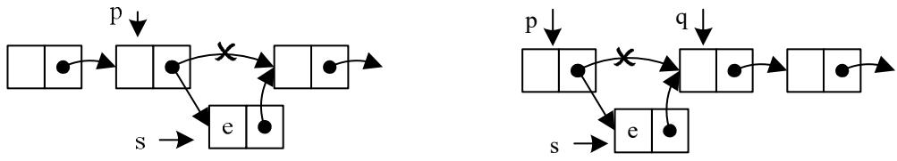  
图 2.10 在节点之后插入  
图 2.11 在节点之前插入

由插入的逻辑图可以看到，在链式情况下的插入和顺序存储时完全不同，这里不需要移动任何一个元素，只需要修改两个指针即可。插入一个节点的关键是要给出插入的位置，不论是什么情况都要先找到一个节点的地址，该节点可能是查找表中的第i个节点，也可能是查找表中元素值为某一特定值的节点，或者是满足其他查找条件的节点。总之，插入节点的问题首先是一个查找问题，找到之后就是进一步确定是插入找到节点的前面还是后面的问题了。

## 1）在指定节点后面插入新节点

由图 2.10 可知，如果是在指定节点 p 的后面插入新节点，则十分容易，假定 p 指向单链表中的某个节点，s 指向待插入的值为 e 的新节点，将节点 s 插入节点 p 的后面，插入语句如下：

注意：

这两条指令的先后顺序不能互换，否则会使链表断开，从而无法准确地完成新节点的插入操作。

## 2）在指定节点前面插入新节点

如果要在指定节点 q 的前面插入新节点，则我们在插入之前就不是查找节点 q 的地址而是需要查找节点 q 的直接前驱节点 p 了。因为插到节点 q 之前，恰好是插在节点 p 之后，而只要知道节点 p，在它后面插入一个新节点的操作就非常简单了，这一点我们刚刚讲过。

设 q 指向单链表中的某个节点，s 指向待插入的值为 e 的新节点，将节点 s 插入节点 q 的前面，插入示意图如图 2.11 所示。

要完成此操作，首先需要找到节点 q 的直接前驱节点 p，然后再在节点 p 之后插入节点 s 即可。设单链表的头指针为 L，插入节点的代码如下：

```gitattributes
p=L;
while(p->next!=q)
    p=p->next;    /*查找*q的直接前驱节点p*/
s->next=p->next;
p->next=s;
```

## 算法 2.14 单链表的插入

```c
int Insert_LinkList (LinkList L, int i, ElemType e)
/*在带头节点的单链表L中的第i个位置之前插入元素e，若插入成功，则返回1，否则返回-1*/
{
    LNode *p, *s;
```

## 数据结构(C语言版)(第三版)(微课版)

```c
int j;
p=L; j=-1; /*从表头开始找前驱节点 p，初始位置为-1*/
while(p->next &&j<i-1) {p=p->next; j++;}    /*寻找第 i-1 个节点*/
if(!p->next || j>i-1) return -1;    /*i 值不合法*/
s=(LNode *)malloc(sizeof(LNode));    /*生成新节点*/
s->data=e;
s->next=p->next; p->next=s;    /*实现插入*/
return 1;
```

由于查找任何一个节点的平均时间复杂度都是 O(n)，因此查找某个节点或者它的前驱节点的平均时间复杂度也都是 O(n)。因此在不知道节点及其前驱节点的地址的情况下，插入一个节点的时间复杂度为 O(n)。

## 8. 删除操作

删除操作的问题首先是一个查找节点的问题，然后就是进一步确定是删除找到的节点还是删除找到的节点的后继节点的问题了。下面分别对这两种情况进行介绍。

## 1) 删除单链表的指定节点

单链表的删除是指删除单链表的第 i 个节点 q，要实现该节点的删除，可将删除位置之前的节点 p(即第 i-1 个节点)的指针指向第 i+1 个节点，然后释放该节点所占用的存储空间，操作示意图如图 2.12 所示。要实现对节点 q 的删除操作，首先要找到节点 q 的直接前驱节点 p，然后将节点 p 的指针改为指向节点 q 的后继节点即可。

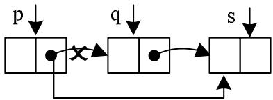  
图 2.12 删除链表中的节点

修改指针的语句如下:

```c
p->next=q->next;
free(q);
```

根据前面的查找算法可知，查找节点 q 的直接前驱节点的时间复杂度为 O(n)。

## 2) 删除单链表的指定节点的后继节点

如果想要删除的是节点 p 的直接后继节点(假设存在)，则可以通过下列语句来完成：

```javascript
s=p->next;
p->next=s->next;
free(s);
```

该操作的时间复杂度为 O(1)。

## 算法 2.15 单链表的删除

```c
int Delete_LinkList (LinkList L, int i, ElemType *e)
/*在带头节点的单链表L中，删除第i个元素，并由e返回其值，若删除成功，则返回1，否则返回-1*/
{
    LNode *p, *q;
    int j;
    p = L; j = -1; /*从表头开始找前驱节点p，初始位置为-1*/
    while (p->next && j < i - 1)    /*寻找第i个节点的前驱节点p*/
    {    p = p->next; j++;    }
    if (!(p->next) || j > i - 1)    return -1;    /*删除位置不合理*/
    q = p->next;    /*q表示被删节点*/
    *e = q->data;    /*用e返回被删节点数据域的值*/
    p->next = q->next; free(q);    /*删除并释放节点*/
    return 1;
}
```

## 9. 单链表的应用

【例 2.2】将两个有序链表 La 和 Lb 合并为一个有序链表。

算法思路：设合并后的链表为 Lc，则无须为 Lc 分配新的存储空间，可直接利用两个链表中原有的节点来链接成一个新表即可。

设立 3 个指针：pa、pb 和 pc，其中 pa 和 pb 分别指向 La 和 Lb 中当前要通过比较后插入的节点，而 pc 指向 Lc 表中当前最后一个节点，若 pa->data≤pb->data，则将 pa 所指节点链接到 pc 所指节点之后，否则将 pb 所指节点链接到 pc 所指节点之后。

对两个链表的节点进行逐次比较时，可将循环的条件设为 pa 和 pb 皆非空，当其中一个为空时，说明有一个表的元素已合并完，则只需要将另一个表的剩余段链接在 pc 所指节点之后即可。

```c
LinkList MergeList_L(LinkList La, LinkList Lb)
/*已知单链表 La 和 Lb 的元素按值非递减排列。合并 La 和 Lb 得到新的单链表 Lc，Lc 的元素也按值非递减排列*/
{
    LNode *pa,*pb,*pc,*Lc;
    pa=La->next; pb=Lb->next;
    Lc=pc=La;    /*将 La 的头节点作为 Lc 的头节点*/
    while(pa&&pb)
    {
    if(pa->data<=pb->data) {pc->next=pa; pc=pa; pa=pa->next;}
    else {pc->next=pb; pc=pb; pb=pb->next;}
    }
    pc->next=pa?pa:pb;    /*插入剩余段*/
    free(Lb);    /*释放 Lb 的头节点*/
    return Lc;
}
```

## 2.3.2 循环链表

对于单链表来说，至关重要的是单链表的头指针，如果不知道单链表的头指针，就无法找到单链表，也就无法对单链表进行插入、查找、删除等任何操作。另外，当我们沿着从单链表头节点开始的指针向后继方向到达某个节点之后，就可以从这个节点开始，遍历单链表的后面部分。但是我们能够发现，如果想遍历这个节点的前面部分，除非仍然从单链表的头节点开始，否则无法做到。那么是否有方法可以使单链表中的任何一个节点都能够起到类似头节点的作用呢？答案是肯定的，只需要改动一个指针，把单链表尾节点的指针域指向头节点就可以了。这样得到的单链表就构成了一个环，我们称其为单向循环链表，如图 2.13 所示。

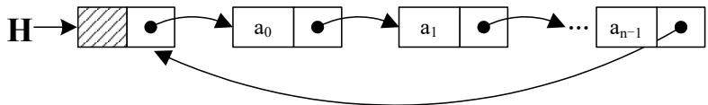  
图 2.13 带头节点的单向循环链表

单向循环链表的操作和单链表的操作基本相同，也需要从头指针进入，查找、插入、删除操作的算法也基本相同，只是在有关遍历的操作(例如查找操作)中，对单链表来说需要从链表头节点循环后移到链表尾节点，以没有后继节点作为判断链表结束的条件。但是对单向循环链表来说，不存在没有后继节点的节点，因为它的链尾节点的指针域也不为空，它的后继节点已经指向了链表的头节点。所以，只需要对算法稍加修改即可。单向循环链表的特性是从任何一个节点开始(不要求是链表头节点)，都可以遍历整个链表，这是单链表所不具备的特性。

正是由于从表中任意一处开始，都可以遍历全表，因此在单向循环链表的操作中，我们甚至可以不设链表的头指针，而只设一个链尾指针(事实上，链尾指针后移一步，就是链表头节点的指针了)，有了链尾指针其实也相当于链头指针已经被获知。

例如，对两个单循环链表 L1、L2 进行连接操作，即将 L2 的第一个数据元素节点连接到 L1 的尾节点之后。若两个单循环链表均通过头指针 h1、h2 指示头节点，则需要从头节点开始依次搜索整个链表来找到单链表 L1 的尾节点，再完成相关的连接工作，其时间复杂度为 $O(n_{1})$ ，其中 $n_{1}$ 为单链表 L1 的元素个数。两个单循环链表若通过尾指针 r1、r2 指示表尾节点来标识单循环链表，则时间复杂度可优化为 $O(1)$ 。两个单循环链表通过尾指针实现的连接过程如图 2.14 所示。

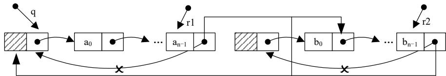  
图 2.14 两个尾指针标识的单向循环链表的连接

实现连接的具体代码如下:

```txt
q=r1->next;    /*保存 L1 的头节点指针*/
r1->next=r2->next->next;    /*L1 和 L2 的尾头相连接*/
free(r2->next);    /*释放 L2 的头节点*/
r2->next=q;    /*组成大的循环链表*/
```

## 2.3.3 双向链表

单向循环链表在某些方面要比单向链表更方便，但仍然存在某些不足。我们知道，所谓“单向”是指节点中只有一个指向其后继节点的指针，由于这个单向性，决定了查找节点的前驱和后继节点的操作很不对称，查找后继节点时，通过指向后继节点的指针就能够很直接便捷地找到目标，但是查找它的前驱节点则必须要从链表的头节点开始，逐个向后遍历，直到找到目标为止。前者可以在常量时间内完成，时间复杂度为O(1)，而后者则取决于节点在链表中的位置，平均时间复杂度为O(n)。为了使查找前驱与查找后继节点的工作一样方便，自然会想到能不能在节点中增加一个指向它前驱节点的指针呢？在链表节点中增加一个指向前驱节点的指针，这个链表就变成了双向链表。

## 1. 双向链表的存储结构描述

```c
typedef struct DuLNode {
    ElemType data;
    struct DuLNode *prior;
    struct DuLNode *next;
} DuLNode, *DuLinkList;
```

双向链表的节点结构如图 2.15 所示。

<table><tr><td>prior</td><td>data</td><td>next</td></tr></table>

图 2.15 双向链表的节点结构

在双向链表中，若 p 为指向表中某一节点的指针，则显然有：

```txt
p->next->prior = p->prior->next = p
```

## 2. 带头节点的双向循环链表

由于双向链表的每个节点都有指向前驱和后继节点的指针，因此在进行插入和删除操作时对指针的修改，也就必须在两个方向上同时进行，否则就可能使双向链表的其中一条链被截断。当然，如果已经出现了这种情况，还可以利用另外一条链对它进行修补，但要尽量避免这种情况的发生。

此外，为了使删除链头、链中和链尾节点的算法统一，在单链表中，我们使用了头节点来解决这个问题，在双向链表中仍然可以做类似的考虑。可以将双向链表看成是后向单链表和前向单链表的两条链表的结合，如果增加一个头节点，可以使后向单链表的算法得到统一，但前向单链表的算法仍然未得到解决。

当然，可以对前向单链表也同样增加一个头节点，这时我们马上就会想到，如果把双向链表的前向单链表和后向单链表共用一个头节点首尾相接，构成一个双向循环链表，这样既能统一两条链表的删除算法，又具备了循环链表的优点。

带头节点的双向循环链表如图 2.16 所示。

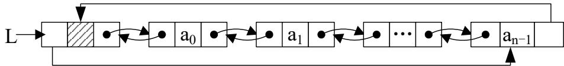  
图 2.16 带头节点的双向循环链表

## 3. 双向链表的插入和删除操作

在双向链表中，对于查找表中的第 i 个节点、查找具有某种性质的具体节点及遍历链表等这类仅涉及一个方向指针的算法仍和单链表的情况相同，但对于插入和删除这样的链表操作就比单链表要方便了许多。

在单链表中，要删除一个节点，只知道该节点的地址 p 是不够的，还必须要耗费 O(n) 的时间来找到该节点的直接前驱节点(在查找某节点的过程中，同时记下它的前驱节点地址)；在插入时，必须要先找到它的插入位置，还要分为插到某节点之前还是之后两种情况，如果要插到地址为 p 的节点之前，又必须要耗费 O(n) 的时间找到 p 的前驱。

一般情况下，为了应用的需要，我们总是在查找某个节点的地址时，同时记下它的前驱地址，否则就要耗费加倍的时间，从而降低了执行效率。但在双向链表中，只要知道某节点的地址，也就同时知道了它的前驱和后继的地址(单链表只能知道后继)，任何情况下都不再需要考虑查找前驱的问题了，因此插入、删除等操作就只是简单地修改指针链而已，这大大降低了程序运行的时间消耗。

当然，如果并不知道插入位置或要删除的节点地址，则依然要耗费 $O(n)$ 的时间去遍历查找目标节点，这是无法避免的，因为这是由线性表的特点决定的。查找条件可以不同，假定我们已经以某一条件找到了一个节点的地址 p，这样就可以进行插入或者删除操作了。

## 1) 双向循环链表的插入操作

带头节点的双向循环链表的插入操作的逻辑结构如图 2.17 所示。

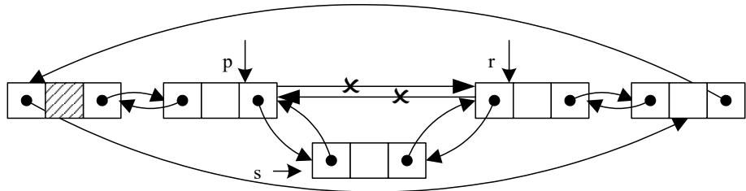  
图 2.17 带头节点的双向循环链表的插入操作(1)

算法 2.16 是在节点 p 之后插入节点 s 的算法代码实现。由于在节点 p 之后插入，也就是插入到 p 节点的后继节点之前，而知道了 p 的地址，它的后继节点也就可以直接被获知(p->next)。

## 算法 2.16 双向循环链表的插入(1)

```c
void inselem(DuLinkList L, ElemType e, DuLNode *p)
/*设 L 为双向循环链表的头节点，在地址为 p 的节点之后插入地址为 s 的新节点*/
{ DuLNode *s, *r;
    s = (DuLNode*)malloc(sizeof(DuLNode));
    s->data = e;    /*建立一个新节点 s*/
    r = p->next;
    s->next = r;
    r->prior = s;    /*插入在节点 p 之后*/
    p->next = s;
    s->prior = p;
}
```

如果在节点 p 之前插入，即插入到 p 节点的前驱节点之后，那么通过 p->prior 即可找到 p 节点的前驱节点，该操作的逻辑结构如图 2.18 所示，算法如算法 2.17 所示。

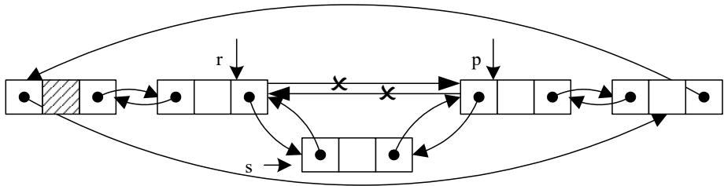  
图 2.18 带头节点的双向循环链表的插入操作(2)

## 算法 2.17 双向循环链表的插入(2)

```c
void inselem(DuLinkList L, ElemType e, DuLNode *p)
/*设 L 为双向循环链表的头节点，在地址为 p 的节点之前插入地址为 s 的新节点*/
{ DuLNode *s,*r;
    s=(DuLNode*)malloc(sizeof(DuLNode));
    s->data=e;    /*建立一个新节点 s*/
    r=p->prior;
    s->next=p;
    r->next=s;    /*在节点 p 之前插入*/
    p->prior=s;
    s->prior=r;
}
```

## 2) 双向循环链表的删除操作

带头节点的双向循环链表的删除操作的逻辑结构如图 2.19 所示，算法 2.18 实现删除地址为 p 的节点的操作。

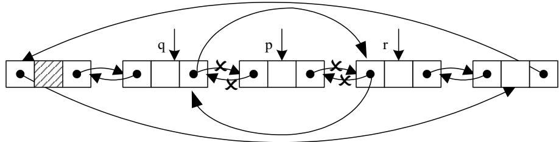  
图 2.19 带头节点的双向循环链表的删除操作

## 算法 2.18 双向循环链表的删除

```c
void delelm(DuLinkList L, ElemType* e, DuLNode *p)
/*设 L 为双向循环链表的头节点，删除地址为 p 的节点*/
{ DuLNode *q,*r;
    q=p->prior;
    r=p->next;
```

## 数据结构(C语言版)(第三版)(微课版)

```txt
q->next=r;
r->prior=q;
e=p->data;
free(p);
}
```

由算法 2.16、算法 2.17 和算法 2.18 可知，如果不计算查找节点的插入位置，则插入只需要修改四个指针，删除只需要修改两个指针。而考虑查找，则和单链表相同，仍需要 O(n) 的时间，但是每个节点却要多占用一个指针的存储空间，这是双向链表额外耗费的资源。

## 2.4 本章实战练习

## 2.4.1 顺序表的常用操作

## 1. 实现顺序表常用操作的代码

```c
#include <stdio.h>
#include <stdlib.h>

#define INIT_SIZE 5    /*线性表存储空间的初始分配量*/
#define INCREMENT 2    /*线性表存储空间的分配增量*/
typedef int ElemType;    /*定义元素类型为 int*/
/*线性表顺序存储结构的定义*/
typedef struct {
    ElemType *elem;    /*存储空间的基地址*/
    int length;    /*当前长度*/
    int listsize;    /*当前分配的存储容量(以 sizeof(ElemType)为单位)*/
} SqList;
/*【算法 2.1 顺序表的初始化】*/
/*初始化顺序表，若成功则返回 1，否则返回-1*/
int InitList_Sq(SqList *L)
{
    L->elem=(ElemType *)malloc(INIT_SIZE*sizeof(ElemType));
    if(!L->elem) return -1;
    L->length=0;
    L->listsize=INIT_SIZE;
    return 1;
}
/*打印顺序表的各个元素*/
void PrintSqList(SqList L)
{
    int i;
    printf("\n 该线性表的元素依次为：\n");
    for(i=0; i<L.length; i++) printf("%d ",L.elem[i]);
    printf("\n");
}
/*输入顺序表各个元素的值*/
void InputSqList(SqList *L)
```

```c
{
    int i,n;
    printf("请输入该线性表的元素个数：n=");
    scanf("%d",&n);
    while(n>L->listsize)
    {
    printf("超出了线性表的存储空间，请重新输入：\n");
    scanf("%d",&n);
    }
    L->length=n;
    printf("请依次输入该线性表各元素的值：\n");
    for(i=0;i<n;i++) scanf("%d",&L->elem[i]);
}
/*【算法2.2 顺序表的插入】*/
/*在顺序表L的第i个位置之前插入新的元素e，若成功则返回1，否则返回-1*/
int ListInsert_Sq(SqList *L, int i, ElemType e)
{
    int j;
    ElemType *newbase;
    if(i<0 || i>L->length) return -1;    /*插入位置不合法*/
    if(L->length>=L->listsize)    /*当前存储空间已满，增加分配*/
    {
    newbase = (ElemType *)realloc(L->elem, (L->listsize + INCREMENT)*sizeof(ElemType));
    if(!newbase) return -1;    /*存储分配失败*/
    L->elem = newbase;
    L->listsize += INCREMENT;
    }
    for(j=L->length-1;j>=i;j--)
    L->elem[j+1] = L->elem[j];    /*插入位置及之后的元素后移*/
    L->elem[i]=e;    /*插入e*/
    ++L->length;    /*表长增1*/
    return 1;
}
/*【算法2.3 顺序表的删除】*/
/*在顺序表L中删除第i个元素，并用e返回其值，若成功则返回1，否则返回-1*/
int ListDelete_Sq(SqList *L, int i, ElemType *e)
{
    int j;
    if(i<0 || i>L->length-1) return -1;    /*i 值不合法*/
    *e=L->elem[i];    /*将被删除元素的值赋给e*/
    for(j=i+1;j<=L->length-1;j++)
    L->elem[j-1]=L->elem[j];    /*被删元素之后的元素前移*/
    --L->length;
    return 1;
}
/*【算法2.4 顺序表的按值查找】*/
/*在顺序线性表L中查找第1个值与e相等的元素的位序，若找到，则返回其在L中的位序，否则返回-1*/
int LocateElem_Sq(SqList L, ElemType e)
{
    int i=0;    /*i 的初值为第一个元素的位序*/
    while(i<L.length&&L.elem[i]!=e) i++;
    if(L.elem[i]==e) return i;
}
```

## 数据结构(C语言版)(第三版)(微课版)

```c
else return -1;
}
/*【算法2.5取顺序表中元素】*/
/*在顺序线性表L中取第i个元素存入e中，若成功，则返回1，否则返回-1*/
int Get_SqList(SqList L, int i, ElemType *e)
{
    if(i<0||i>L.length-1) return -1;    /*没有第i个元素，读取失败*/
    *e=L.elem[i];
    return 1; /*读取成功*/
}
int main()
{
    SqList L;
    int status, e, i;
    status=InitList_Sq(&L);
    if(status==1) printf("顺序表初始化成功！\n");
    else {printf("顺序表初始化失败！"); return 0;}
    InputSqList(&L);    /*输入顺序表的各元素值*/
    PrintSqList(L);
    printf("请输入插入位置:");
    scanf("%d", &i);
    status=ListInsert_Sq(&L, i, 30);    /*在第i个元素之前插入30*/
    if(status==1) {printf("进行插入操作后"); PrintSqList(L);} 
    else {printf("\n插入失败！"); return 0;}
    printf("请输入删除位置:");
    scanf("%d", &i);
    status=ListDelete_Sq(&L, i, &e);    /*删除线性表的第i个元素，用e返回其值*/
    if(status==1)
    {
    printf("\n被删除元素的值为：%d", e);
    printf("\n进行删除操作后");
    PrintSqList(L);
    }
    else {printf("\n删除失败！"); return 0;}
    i=LocateElem_Sq(L, 15);
/*在顺序表L中查找第1个值与15相等的元素的位序*/
if(i!=-1){printf("其值与15相等的元素在线性表中的位序为：%d\n", i);}
else {printf("\n查找15失败");}
i=LocateElem_Sq(L, 36);
/*在顺序表L中查找第1个值与36相等的元素的位序*/
if(i!=-1){printf("其值与36相等的元素在线性表中的位序为：%d\n", i);}
else {printf("\n查找36失败");}
printf("请输入读取元素的位置:");
scanf("%d", &i);
status=Get_SqList(L, i, &e);
if(status==1) printf("\n读取相应位置的元素的值为：%d\n", e);
free(L.elem);
return 0;
}
```

## 2. 顺序表常用操作的程序运行结果

顺序表常用操作的程序运行结果如图 2.20 所示。

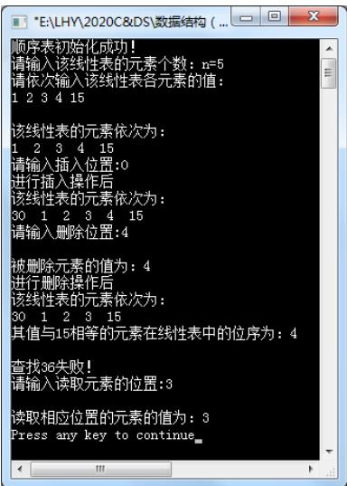  
图 2.20 顺序表常用操作的程序运行结果

## 2.4.2 单链表的常用操作

## 1. 实现单链表常用操作的代码

```c
#include <stdio.h>
#include <stdlib.h>

typedef int ElemType;    /*定义元素类型为 int*/
/*线性表的链式存储结构定义*/
typedef struct LNode {
ElemType data;
struct LNode *next;
} LNode, *LinkList;
/*【算法 2.9 通过尾插入法建立带头节点的单链表】*/
/*建立带头节点的单链表 L，输入 n 个元素的值*/
LinkList Create_LinkList(int n)
{
    LNode *L,*p,*q;
    int i;
    L=(LNode *)malloc(sizeof(LNode));
    L->next=NULL;    /*先建立一个带头节点的单链表*/
    q=L;    /*q 的初始值指向头节点*/
    for(i=0; i<=n-1; i++)
    {
    p=(LNode *)malloc(sizeof(LNode));    /*生成新节点*/
    printf("请输入第%d 个元素的值:",i);
    scanf("%d",&p->data);    /*输入元素值*/
    p->next=NULL;    q->next=p;    q=p;    /*将该节点插入表尾*/
```

## 数据结构(C语言版)(第三版)(微课版)

```c
}
return L;
}
/*打印链表中各元素的值*/
void Print_LinkList(LinkList L)
{
    LNode *p;
    p=L->next;
    printf("\n 单链表中各元素值为：");
    while(p){ printf("%d ",p->data); p=p->next; }
}
/*【算法 2.14 单链表的插入】*/
/*在带头节点的单链表 L 中的第 i 个位置之前插入元素 e，若插入成功，则返回 1，否则返回 -1*/
int Insert_LinkList(LinkList L, int i, ElemType e)
{
    LNode *p, *s;
    int j;
    p=L; j=-1;
    while(p->next &&j<i-1) {p=p->next; j++; } /*寻找第 i-1 个节点*/
    if(!p->next ||j>i-1) return -1; /*i 值不合法*/
    s=(LNode *)malloc(sizeof(LNode)); /*生成新节点*/
    s->data=e;
    s->next=p->next; p->next=s; /*实现插入*/
    return 1;
}
/*【算法 2.15 单链表的删除】*/
/*在带头节点的单链表 L 中，删除第 i 个元素，并由 e 返回其值，若删除成功，则返回 1，否则返回 -1*/
int Delete_LinkList(LinkList L, int i, ElemType *e)
{
    LNode *p, *q;
    int j;
    p=L; j=0;
    while(p->next &&j<i-1) {/*寻找第 i 个节点，并令 p 指向其前驱*/
    p=p->next; j++;
    }
    if(!(p->next)||j>i-1) return -1; /*删除位置不合理*/
    q=p->next;
    *e=q->data; /*用 e 返回被删节点数据域的值*/
    p->next=q->next; free(q); /*删除并释放节点*/
    return 1;
}
/*【算法 2.13 单链表的按值查找】*/
/*在带头节点的单链表 L 中查找与给定值相同的元素的位序*/
int Locate_LinkElem(LinkList L, ElemType e)
{
    LNode *p;
    int i;
    p=L->next; i=0;
    while(p->next &&p->data!=e) {p=p->next; i++; }
    if(p->data!=e) return -1;
```

```c
else return i;
}
int main()
{
    LinkList L;    /*定义一个头指针，以指示一个单链表*/
    int n,i,e,status;
    printf("请输入单链表的长度：n=");
    scanf("%d",&n);
    L=Create_LinkList(n);    /*建立一个含 n 个元素的单链表*/
    Print_LinkList(L);    /*依次输出线性表中各元素的值*/
    status=Insert_LinkList(L,4,27);    /*在第 4 个元素之前插入值 27*/
    if(status==1){printf("\n\n 进行插入操作后");Print_LinkList(L);} else{ printf("\n 插入失败！");}
    status=Delete_LinkList(L,5,&e);    /*删除第 5 个元素*/
    if(status==1)
    {
    printf("\n\n 被删除元素的值为：%d",e);
    printf("\n\n 进行删除操作后");
    Print_LinkList(L);
    }
    else{ printf("\n 删除失败！"); }
    printf("\n\n 请输入要查找的值：e=");
    scanf("%d",&e);
    i=Locate_LinkElem(L,e);
    if(i>=0) printf("该元素在线性表中的位序为：%d\n",i);
    else printf("该元素在线性表中不存在\n");
    return 0;
}
```

## 2. 程序运行结果

单链表常用操作的程序运行结果如图 2.21 所示。

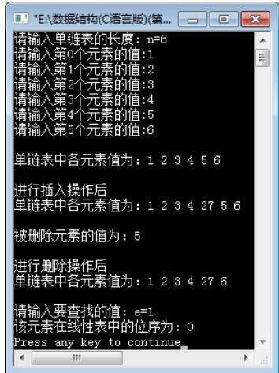  
(a) 查找成功

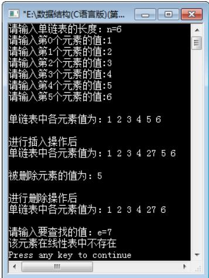  
(b) 查找失败  
图 2.21 单链表常用操作的程序运行结果

## 2.4.3 通讯录管理

请编程实现通讯录管理功能，包括通讯录的建立、新增通讯者、删除通讯者、通讯者的查询以及通讯录的输出等。

为了实现通讯录管理的集中操作功能，首先设计一个含有多个菜单项的主控菜单程序，然后再为这些菜单项配上相应的功能。

## 1. 程序功能

要求程序运行后，给出 6 个菜单项的内容和输入提示:

(1) 通讯录链表的建立;

(2) 通讯者节点的插入;

(3) 通讯者节点的查询;

(4) 通讯者节点的删除;

(5) 通讯录链表的输出;

(6) 退出管理系统。

使用数字 0～5 来选择菜单功能，其他输入则不起作用。

## 2. 程序实现代码

程序实现代码如下:

```c
/******************************************************************************************/*
/* 通讯录管理 */
/******************************************************************************************/
#include<stdio.h>
#include<string.h>
#include<stdlib.h>
typedef struct    /*定义通讯录节点类型*/
{    char num[5];    /*编号*/
    char name[9];    /*姓名*/
    char sex[3];    /*性别*/
    char phone[13];    /*电话*/
    char addr[3];    /*地址*/
}ElemType;
typedef struct node    /*定义节点的类型*/
{    ElemType data;    /*定义节点的数据域*/
    struct node *next;    /*定义节点的指针域*/
}ListNode;
typedef ListNode *LinkedList;
LinkedList head;
ListNode *p;
/*******************************************************************************************/
/* 输出主控菜单 */
/*******************************************************************************************/
int menu_select()
{    int sn;
```

```c
printf("欢迎进入通讯录管理程序：\n");
printf("1. 通讯录链表的建立\n");
printf("2. 通讯者节点的插入\n");
printf("3. 通讯者节点的查询\n");
printf("4. 通讯者节点的删除\n");
printf("5. 通讯录链表的输出\n");
printf("0. 退出管理系统\n");
printf("请用数字键 0-5 来选择菜单:");
for ( ; ; )
{ scanf("%d",&sn);
if(sn<0 || sn>5) printf("\n\t 输入错误，只允许输入 0-5 数字键！\n");
else break;
}
return sn;
}
/*****************************************************************************************/
/* 用尾插法建立通讯录链表 */
/*****************************************************************************************/
LinkList CreateList(void)
{
    LinkList head=(ListNode *)malloc(sizeof(ListNode));/*动态生成头节点*/
    ListNode *p,*rear;
    int flag=0;    /*定义录入结束符*/
    rear=head;    /*尾指针初始化，指向头节点*/
    while(flag==0)    /*只要录入不为 0，则不停地通过尾插法建立链表*/
    {
    p=(ListNode *)malloc(sizeof(ListNode));
    printf("编号    姓名    性别    联系电话    地址\n");
    printf("----\n");
    scanf("%s%s%s%s%s",p->data.num,p->data.name,p->data.sex, p->data.phone,p->data.addr);
    rear->next=p;    /*新节点连接为尾节点的后继节点*/
    rear=p;    /*尾节点移到新建节点的位置*/
    printf("结束建表吗？(1/0): ");
    scanf("%d",&flag);    /*读入一个标志位到 flag*/
    }
    rear->next=NULL;    /*建表结束，最后一个节点的指针域置为 NULL*/
    return head;    /*返回链表的头指针*/
}
/*****************************************************************************************/
/* 通讯者节点的插入 */
/*****************************************************************************************/
void InsertNode(LinkList head,ListNode *p)
{
    ListNode *p1,*p2;
    p1=head; p2=p1->next;
    while(p2!=NULL && (strcmp(p2->data.num,p->data.num)<0))
    {
    p1=p2;    /*p1 指向刚访问过的节点*/
    p2=p2->next;    /*p2 指向表的下一个节点*/
    }
    p1->next=p;    /*插入 p 所指向的节点*/
    p->next=p2;    /*连接表中的剩余部分*/
}
/*****************************************************************************************/
```

## 数据结构(C语言版)(第三版)(微课版)

```c
/* 通讯者节点的查找 */
/**********/
ListNode * ListFind(LinkList head)
{
    ListNode *p;
    char num[5];
    char name[9];
    int xz;
    printf("--------\n");
    printf("1. 按编号查询 \n");
    printf("2. 按姓名查询 \n");
    printf("--------\n");
    printf("请选择 ");
    p=head->next;
    scanf("%d",&xz);
    if(xz=1)
    {
    printf("请输入要查找通讯者的编号：");
    scanf("%s",num);
    while(p && strcmp(p->data.num,num)<0) p=p->next;
    if(p==NULL || strcmp(p->data.num,num)>0) p=NULL;
    }
    else
    if(xz=2)
    {
    printf("请输入要查找者的姓名：");
    scanf("%s",name);
    while(p && strcmp(p->data.name,name)!=0) p=p->next;
    }
    return p;
}
/**********/
/* 通讯者节点的删除 */
/**********/
void DelNode(LinkList head)
{
    char jx;
    ListNode *p,*q;
    p=ListFind(head);    /*调用查找函数*/
    if(p==NULL){printf("没有查找到要删除的通讯者！\n");return;}
    printf("确定要删除该通讯者？(y/n): ");
    scanf("%c",&jx);
    if(jx='y'||jx='Y')
    {
    q=head;
    while(q!=NULL && q->next!=p) q=q->next;
    q->next=p->next;    /*删除节点*/
    free(p);    /*释放被删除的节点*/
    printf("通讯者已经被删除！\n");
    }
}
/**********/
/* 通讯录链表的输出 */
/**********/
void PrintList(LinkList head)
```

```c
c
{
    ListNode *p;
    p=head->next;    /*使 p 指向最前面的节点*/
    printf("编号    姓名    性别    联系电话    地址\n");
    printf("----\n");
    while (p!=NULL)
    {
    printf("%s%s%s%s%s",p->data.num,p->data.name,p->data.sex, p->data.phone,p->data.addr);
    printf("----\n");
    p=p->next;    /*后移一个节点*/
    }
}
/*定义主函数*/
void main()
{
    for (; ; )
    {
    switch(menu_select())
    {
    case 1:
    printf("**************************\n");
    printf("* 通讯录链表的建立 *\n");
    printf("**************************\n");
    head=CreateList();
    break;
    case 2:
    printf("**************************\n");
    printf("* 通讯者节点的插入 *\n");
    printf("**************************\n");
    printf("编号(4)姓名(8)性别电话(11)地址(31)\n");
    printf("**************************\n");
    p=(ListNode *)malloc(sizeof(ListNode));
    scanf("%s%s%s%s%s",p->data.num,p->data.name,p->data.sex, p->data.phone,p->data.addr);
    InsertNode(head,p);
    break;
    case 3:
    printf("**************************\n");
    printf("* 通讯者节点的查询 *\n");
    printf("**************************\n");
    p=ListFind(head);
    if(p!=NULL)
    {
    printf("编号 姓名 性别 联系电话 地址\n");
    printf("----\n");
    printf("%s%s%s%s%s",p->data.num,p->data.name,p->data.sex, p->data.phone,p->data.addr);
    printf("----\n");
    }
    else printf("没有查找到查询的通讯者！\n");
    break;
case 4:
    printf("**************************\n");
    printf("* 通讯者节点的删除 *\n");
    printf("**************************\n");
    DelNode(head);
    break;
case 5 :
```

```c
printf("**************************\n");
printf("* 通讯录链表的输出 *\n");
printf("**************************\n");
PrintList(head);
break;
case 0 :
printf("\t 退出程序！ \n");
return;
}
}
```

## 3. 程序的运行结果

程序的运行结果如图 2.22 所示。

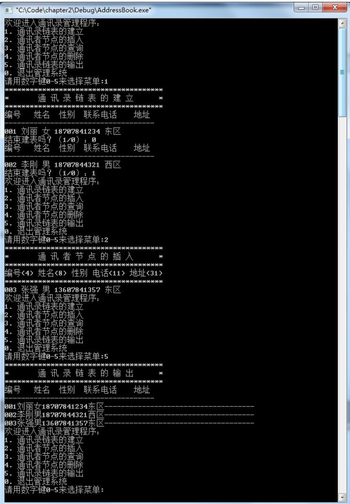  
图 2.22 通讯录程序的运行结果